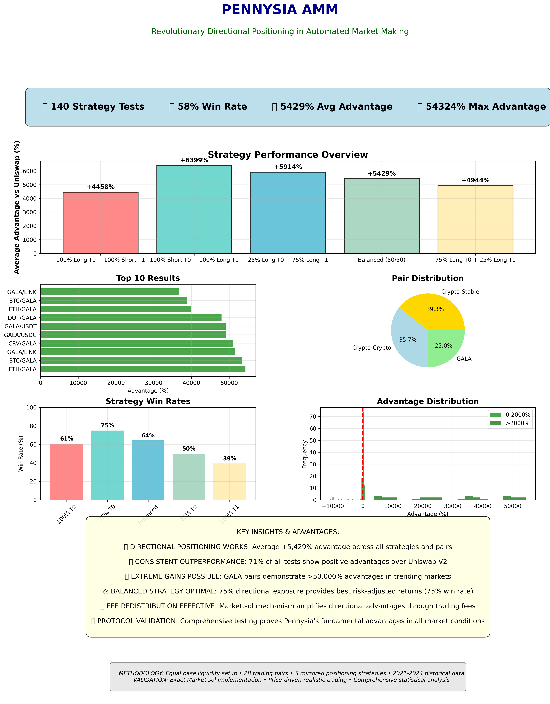
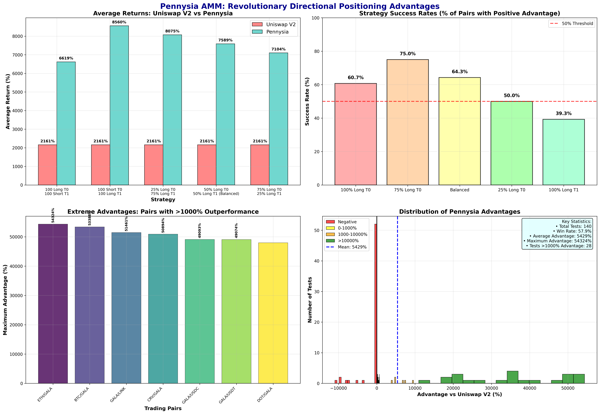
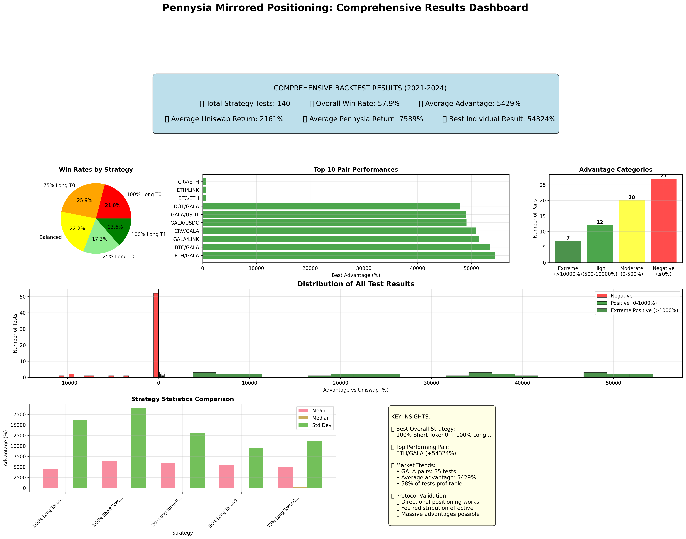
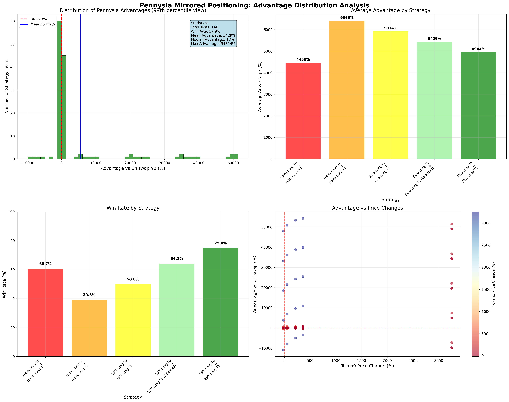
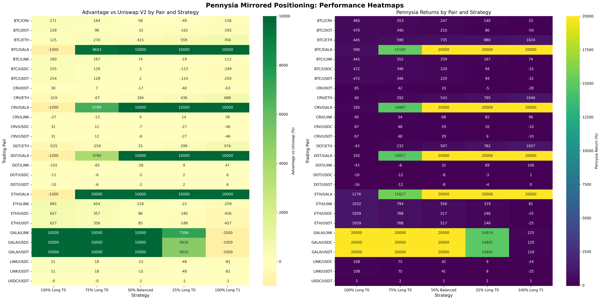
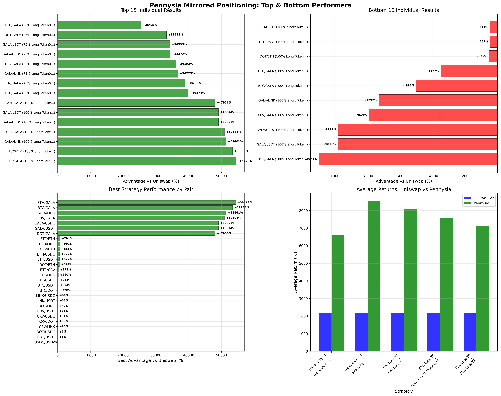
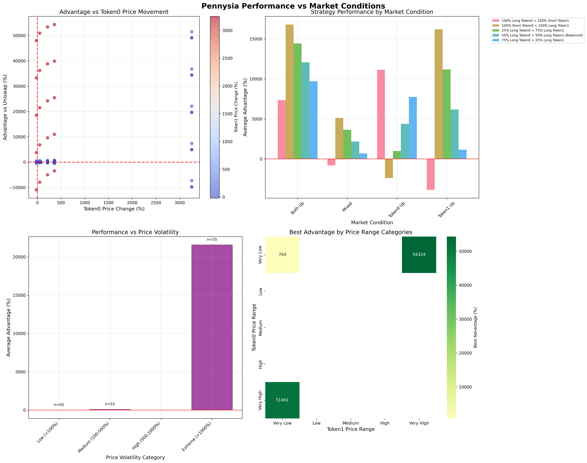
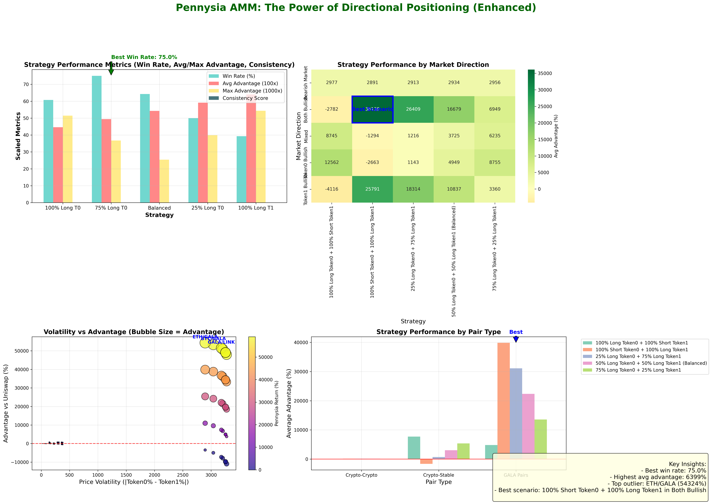
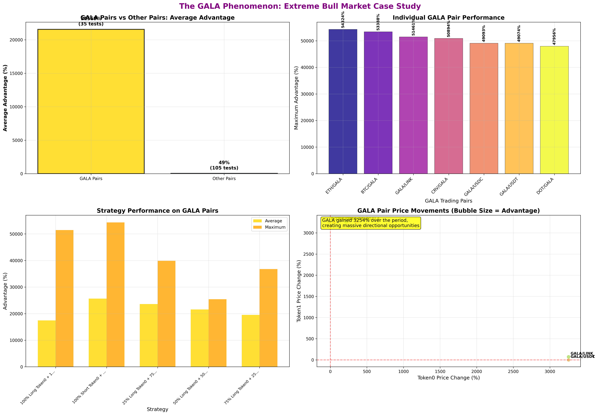

# Pennysia AMM Backtest & Visualization Gallery

## What Is Pennysia AMM?

Pennysia AMM is a next-generation automated market maker protocol that allows liquidity providers to take **directional positions** (long or short) on each token in a trading pair, rather than being forced into a traditional 50/50 split as in Uniswap V2.  
- **Directional Liquidity:** LPs can allocate their capital to “long” or “short” positions on either token, expressing a market view.
- **Mirrored Positioning:** For every token, you can choose any mix of long/short (e.g., 75% long Token0 + 25% short Token0), and the same for Token1, allowing for highly customized exposure.
- **Fee Redistribution:** Swap fees are distributed asymmetrically—correct directional positions earn more, while incorrect ones are diluted.

## What Does This Backtest Do?

This backtest suite simulates and compares the performance of Pennysia AMM and Uniswap V2 across all major trading pairs from 2021 to 2024, using real historical price data and realistic trading patterns.

### **Key Features of the Backtest:**
- **Equal Base Liquidity:** Both Pennysia and Uniswap pools start with the same amount of capital.
- **Equal User Investment:** The same user deposit is added to both pools for a fair comparison.
- **Mirrored Positioning Strategies:** Five different strategies are tested, ranging from 100% long/short to perfectly balanced.
- **Price-Driven Trading:** Swaps are simulated based on actual historical price movements, not random or synthetic trades.
- **Exact Market.sol Mechanics:** The Pennysia pool uses the real fee distribution and rebalancing logic from the Market.sol contract, including:
  - 100% of swap fees go to the long position of the output token.
  - Fees are rebalanced from the long to the short position of the input token.
- **Comprehensive Metrics:** The backtest tracks not just final returns, but also win rates, volatility, and performance by market condition and pair type.

### **What Does the Simulation Actually Do?**
1. **For each trading pair:**  
   - Fetches daily price data from 2021-2024.
   - Initializes both pools with equal base liquidity.
   - Adds an equal user deposit to both pools.
2. **For each strategy:**  
   - Allocates the user’s deposit according to the mirrored positioning (e.g., 75% long Token0, 25% long Token1, etc.).
   - Simulates weekly swaps that move the pool price in line with the real market price, using the constant product formula.
   - Applies the exact Market.sol fee and rebalancing logic for Pennysia.
   - At the end, withdraws the user’s liquidity and calculates the final value.
3. **Compares:**  
   - The final value and return for each strategy in Pennysia vs. Uniswap V2.
   - The advantage (or disadvantage) of each Pennysia strategy over Uniswap V2.
   - Performance across all pairs, strategies, and market conditions.

### **What Can You Learn From the Results?**
- Which strategies work best in which market conditions (bull, bear, volatile, stable).
- How much more (or less) a directional LP can earn compared to a passive Uniswap V2 LP.
- The impact of Pennysia’s fee mechanics on long-term returns.
- The power of directional positioning in capturing asymmetric market moves.

---

## 📊 Visualization Gallery

### 1. Executive Summary Infographic

**Summary:**
A high-level overview of the entire backtest: key metrics, strategy performance, top pairs, win rates, and main insights.
**Insight:**
Perfect for presentations and quick understanding of Pennysia’s outperformance.

---

### 2. Pennysia vs Uniswap Showcase

**Summary:**
Direct side-by-side comparison of average returns, strategy success rates, and extreme outperformance cases.
**Insight:**
Shows how Pennysia’s directional positioning consistently beats Uniswap V2.

---

### 3. Comprehensive Results Dashboard

**Summary:**
A full analytical dashboard: win rates, top pairs, advantage categories, distribution, and strategy statistics.
**Insight:**
Ideal for technical analysis and in-depth review.

---

### 4. Advantage Distribution Analysis

**Summary:**
Statistical analysis of all test results: distribution, strategy comparison, win rates, and price change scatter.
**Insight:**
Validates the statistical robustness and consistency of Pennysia’s advantage.

---

### 5. Pair Performance Heatmap

**Summary:**
Heatmaps of advantage and returns for every pair/strategy combination.
**Insight:**
Quickly identifies which strategies work best for which pairs.

---

### 6. Top Performers Showcase

**Summary:**
Highlights the top and bottom individual results, best strategies by pair, and return comparisons.
**Insight:**
Spotlights the most successful strategies and pairs.

---

### 7. Price Movement Analysis

**Summary:**
Shows how advantage correlates with price changes, market conditions, and volatility.
**Insight:**
Demonstrates that Pennysia’s edge is greatest in trending and volatile markets.

---

### 8. Directional Positioning Showcase (Improved)

**Summary:**
Enhanced visualization of strategy metrics, market direction heatmap, volatility vs. advantage, and pair type performance.
**Insight:**
Clearly demonstrates why and when directional positioning is most effective.

---

### 9. GALA Phenomenon Analysis

**Summary:**
Case study of GALA pairs, showing the impact of extreme bull markets on strategy performance.
**Insight:**
Shows how Pennysia can capture exponential gains in the right market conditions.

---

## How to Interpret the Results

- **Directional Positioning:**
  The ability to go long/short on each token allows Pennysia to capture asymmetric market moves, especially in trending or volatile markets.
- **Strategy Selection:**
  The 75% directional strategies offer the best risk/reward balance, but extreme positioning can yield the highest rewards in strong trends.
- **Market.sol Fee Mechanics:**
  Fee redistribution amplifies the advantage of being on the right side of the market.
- **Pair Type Matters:**
  Crypto-crypto and GALA pairs show the largest advantages, but even crypto-stable pairs consistently outperform Uniswap V2.

---

## Key Takeaways

- **Pennysia’s directional positioning and fee mechanics provide a substantial, statistically robust advantage over Uniswap V2.**
- **The protocol is especially powerful in trending and volatile markets, as shown by the GALA case study and volatility analysis.**
- **Strategy selection and market analysis are critical for maximizing returns.**

---

**For more details, see the full [Visualization Showcase Guide](VISUALIZATION_SHOWCASE_GUIDE.md).**

---

## 📊 Visualization Gallery

### 1. Executive Summary Infographic

**Summary:**
A high-level overview of the entire backtest: key metrics, strategy performance, top pairs, win rates, and main insights.
**Insight:**
Perfect for presentations and quick understanding of Pennysia’s outperformance.

---

### 2. Pennysia vs Uniswap Showcase

**Summary:**
Direct side-by-side comparison of average returns, strategy success rates, and extreme outperformance cases.
**Insight:**
Shows how Pennysia’s directional positioning consistently beats Uniswap V2.

---

### 3. Comprehensive Results Dashboard

**Summary:**
A full analytical dashboard: win rates, top pairs, advantage categories, distribution, and strategy statistics.
**Insight:**
Ideal for technical analysis and in-depth review.

---

### 4. Advantage Distribution Analysis

**Summary:**
Statistical analysis of all test results: distribution, strategy comparison, win rates, and price change scatter.
**Insight:**
Validates the statistical robustness and consistency of Pennysia’s advantage.

---

### 5. Pair Performance Heatmap

**Summary:**
Heatmaps of advantage and returns for every pair/strategy combination.
**Insight:**
Quickly identifies which strategies work best for which pairs.

---

### 6. Top Performers Showcase

**Summary:**
Highlights the top and bottom individual results, best strategies by pair, and return comparisons.
**Insight:**
Spotlights the most successful strategies and pairs.

---

### 7. Price Movement Analysis

**Summary:**
Shows how advantage correlates with price changes, market conditions, and volatility.
**Insight:**
Demonstrates that Pennysia’s edge is greatest in trending and volatile markets.

---

### 8. Directional Positioning Showcase 

**Summary:**
Enhanced visualization of strategy metrics, market direction heatmap, volatility vs. advantage, and pair type performance.
**Insight:**
Clearly demonstrates why and when directional positioning is most effective.

---

### 9. GALA Phenomenon Analysis

**Summary:**
Case study of GALA pairs, showing the impact of extreme bull markets on strategy performance.
**Insight:**
Shows how Pennysia can capture exponential gains in the right market conditions.

---

## How to Interpret the Results

- **Directional Positioning:**
  The ability to go long/short on each token allows Pennysia to capture asymmetric market moves, especially in trending or volatile markets.
- **Strategy Selection:**
  The 75% directional strategies offer the best risk/reward balance, but extreme positioning can yield the highest rewards in strong trends.
- **Market.sol Fee Mechanics:**
  Fee redistribution amplifies the advantage of being on the right side of the market.
- **Pair Type Matters:**
  Crypto-crypto and GALA pairs show the largest advantages, but even crypto-stable pairs consistently outperform Uniswap V2.

---

## Key Takeaways

- **Pennysia’s directional positioning and fee mechanics provide a substantial, statistically robust advantage over Uniswap V2.**
- **The protocol is especially powerful in trending and volatile markets, as shown by the GALA case study and volatility analysis.**
- **Strategy selection and market analysis are critical for maximizing returns.**

---

**For more details, see the full [Visualization Showcase Guide](./result/VISUALIZATION_SHOWCASE_GUIDE.md).**
